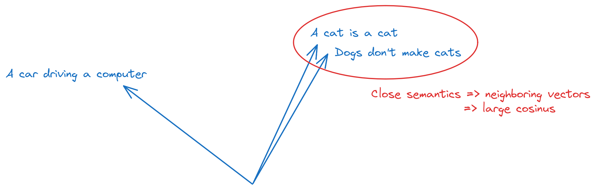
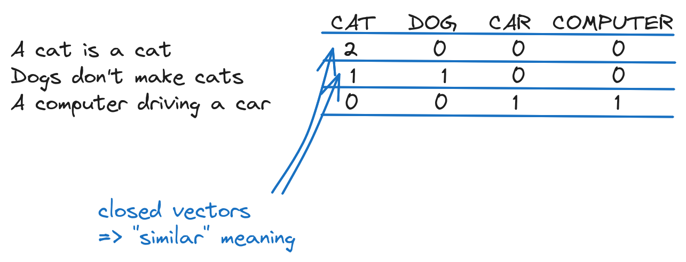
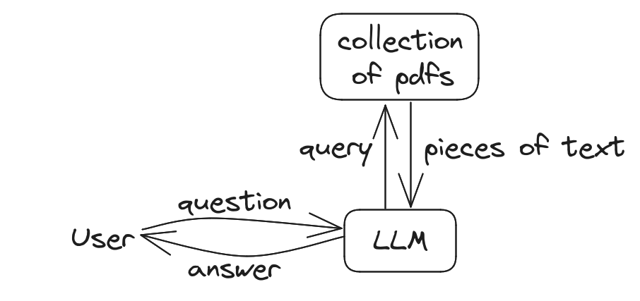
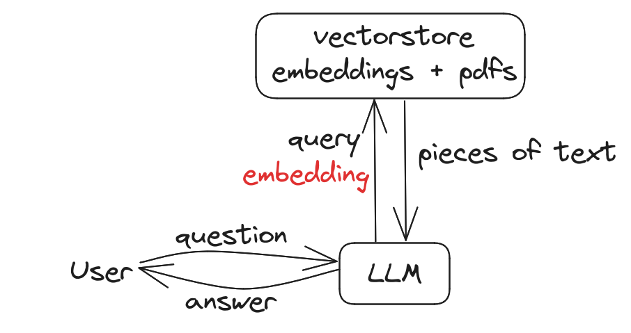
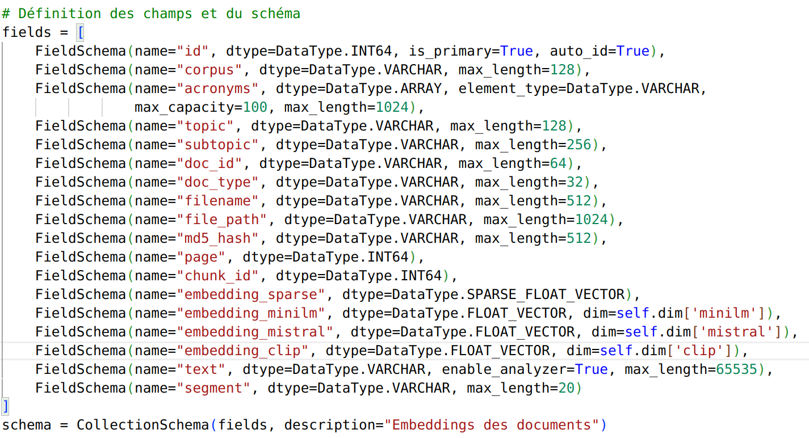

# TP3. Systèmes RAG et bases vectorielles

**Durée : 2 h.**

## Objectifs

- Comprendre comment représenter un texte par un vecteur numérique pour raisonner sur sa
  **sémantique**, pas seulement sur ses mots.
- Mesurer la proximité entre deux textes par une similarité cosinus.
- Construire un premier pipeline de **RAG** (*Retrieval-Augmented Generation*) : aller
  chercher un contexte pertinent avant de répondre, plutôt que de tout demander au modèle.
- Indexer un corpus de documents dans une base vectorielle (FAISS) et l'interroger.

## Prérequis

Le [TP1](tp1-premiers-pas.md) et le [TP2](tp2-sorties-structurees.md) : appeler un modèle
Mistral, composer une chaîne. Bibliothèques supplémentaires pour ce TP :
`scikit-learn`, `sentence-transformers`, `langchain-community`, `langchain-huggingface`,
`langchain-text-splitters`, `faiss-cpu`, `pypdf`.

## Ressources

- [Documentation LangChain, RAG](https://python.langchain.com/docs/tutorials/rag/).
- [sentence-transformers](https://www.sbert.net/).
- [Le QCM d'auto-évaluation de ce TP](qcm/qcm_tp3.html){ target=_blank }, à faire après la
  séance.

!!! info "Ce TP s'exécute sur votre machine, pas dans le navigateur"
    Comme aux TP précédents, les blocs de code appellent des bibliothèques et parfois des
    API distantes ; ils sont donnés à titre d'exemple, à recopier dans votre environnement
    local (voir la [mise en route](demarrage.md)).

---

## Étape 1. Pourquoi représenter un texte par un vecteur (10 min)

Comparer deux textes mot à mot ne capture pas leur sens : « voiture » et « automobile »
n'ont aucune lettre en commun, et pourtant ils désignent presque la même chose. Un
**embedding** résout ce problème en transformant un texte en un vecteur de nombres, de
telle sorte que deux textes proches par le sens deviennent deux vecteurs proches dans
l'espace.



C'est cette propriété, la proximité sémantique devient une proximité géométrique, qui rend
possible tout ce que fait ce TP : chercher un document pertinent, détecter un doublon, ou
fournir à un modèle de langage un contexte utile avant de répondre.

!!! question "Exercice 1.1 : trois usages de la proximité sémantique"
    Citez trois applications concrètes où comparer des textes par leur sens, plutôt que
    par leurs mots exacts, change le résultat : un moteur de recherche, un système de
    recommandation, une détection de doublons, un tri de courriels...

    **Résultat attendu :** trois exemples, chacun justifiant pourquoi une simple
    comparaison de mots (« est-ce que le mot X apparaît dans les deux textes ? »)
    échouerait là où la sémantique réussit.

    ??? success "Piste de réponse"
        Un moteur de recherche interne à une entreprise, interrogé avec « comment annuler
        un abonnement », doit remonter une page titrée « résiliation de contrat » même si
        aucun mot n'est commun aux deux phrases. Une comparaison mot à mot renverrait zéro
        résultat ; une comparaison par embeddings les rapproche parce qu'« annuler un
        abonnement » et « résiliation de contrat » désignent la même intention.

## Étape 2. La représentation la plus simple : le sac de mots (15 min)

Avant les embeddings modernes, la méthode la plus simple pour transformer un texte en
vecteur consiste à compter les mots qu'il contient, sans tenir compte de leur ordre : le
**sac de mots** (*bag of words*).

```python title="tp3_bow.py"
from sklearn.feature_extraction.text import CountVectorizer

corpus = [
    "Demonstration text, first document",
    "Demo text, and here's a second document.",
    "And finally, this is the third document.",
]

vectorizer = CountVectorizer()
X = vectorizer.fit_transform(corpus)

print("Vocabulaire :", vectorizer.get_feature_names_out())
print("Matrice :\n", X.toarray())
```



Chaque ligne de la matrice est le vecteur d'un document, chaque colonne compte les
occurrences d'un mot du vocabulaire. C'est un embedding au sens large, un texte devenu
vecteur, mais un embedding aveugle au sens : « je n'aime pas ce film » et « j'aime ce
film » partagent presque tous leurs mots.

!!! question "Exercice 2.1 : les limites du sac de mots"
    Ajoutez un quatrième document contenant un synonyme d'un mot déjà présent dans le
    corpus (par exemple `"A further, extra document appears here."` pour faire écho à
    `"document"`, ou tout autre exemple de votre choix avec un vrai synonyme). Le sac de
    mots rapproche-t-il ce document des autres autant qu'il le devrait ?

    **Résultat attendu :** le vocabulaire s'enrichit d'une nouvelle colonne pour chaque
    mot inédit, mais un synonyme qui n'est **pas orthographiquement identique** à un mot
    déjà présent n'est relié à rien : le sac de mots ne sait pas que deux mots différents
    peuvent signifier la même chose.

    ??? success "Corrigé"
        ```python title="exercice 2.1"
        corpus_etendu = corpus + ["A further, extra document appears here."]
        X2 = vectorizer.fit_transform(corpus_etendu)
        print(vectorizer.get_feature_names_out())
        print(X2.toarray())
        ```

        « further » et « extra » n'ont aucun lien avec « second » ou « third » dans cette
        représentation, alors qu'ils en sont sémantiquement proches. C'est exactement la
        limite que les embeddings de l'étape suivante corrigent : ils sont entraînés sur
        de grands volumes de texte, et apprennent que des mots employés dans des contextes
        similaires doivent recevoir des vecteurs proches.

## Étape 3. Des embeddings qui comprennent le contexte (20 min)

La bibliothèque `sentence-transformers` fournit des modèles entraînés pour produire des
vecteurs qui capturent le sens d'une phrase entière, pas seulement le compte de ses mots :

```python title="tp3_embeddings.py"
from sentence_transformers import SentenceTransformer
import numpy as np

phrases = [
    "This is an example sentence.",
    "Each sentence is converted into a fixed-sized vector.",
    "The weather is nice today.",
]

modele = SentenceTransformer("sentence-transformers/all-MiniLM-L6-v2", device="cpu")
vecteurs = modele.encode(phrases)

for phrase, vecteur in zip(phrases, vecteurs):
    print(f"{phrase!r} -> vecteur de taille {len(vecteur)}, débute par {vecteur[:3]}")


def similarite_cosinus(a, b):
    return np.dot(a, b) / (np.linalg.norm(a) * np.linalg.norm(b))


print("phrase 1 vs phrase 2 :", similarite_cosinus(vecteurs[0], vecteurs[1]))
print("phrase 1 vs phrase 3 :", similarite_cosinus(vecteurs[0], vecteurs[2]))
```

La similarité cosinus mesure l'angle entre deux vecteurs plutôt que leur distance brute :
elle vaut `1` pour deux vecteurs identiques en direction, `0` pour deux vecteurs sans
rapport, et elle ne dépend pas de la longueur des textes comparés.

!!! question "Exercice 3.1 : la phrase la plus proche"
    Écrivez une fonction `plus_proche(requete, phrases, modele)` qui renvoie, parmi une
    liste de phrases, celle dont l'embedding a la plus grande similarité cosinus avec
    l'embedding de `requete`.

    **Résultat attendu :** avec `requete = "How big is the vector?"` et les `phrases`
    ci-dessus, la fonction renvoie la deuxième phrase (celle qui parle de la taille du
    vecteur), pas la première ni la troisième.

    ??? success "Corrigé"
        ```python title="exercice 3.1"
        def plus_proche(requete, phrases, modele):
            vecteur_requete = modele.encode([requete])[0]
            vecteurs_phrases = modele.encode(phrases)
            scores = [similarite_cosinus(vecteur_requete, v) for v in vecteurs_phrases]
            indice = max(range(len(phrases)), key=lambda i: scores[i])
            return phrases[indice], scores[indice]

        print(plus_proche("How big is the vector?", phrases, modele))
        ```

        C'est exactement le mécanisme de recherche derrière un système de RAG : au lieu de
        comparer la question à chaque document mot à mot, on compare leurs embeddings, et
        on récupère celui dont le score est le plus haut. L'étape 6 fait la même chose à
        plus grande échelle, avec une base de documents plutôt que trois phrases.

!!! tip "Pour comparer : les embeddings distants (OpenAI)"
    Les fournisseurs d'API proposent aussi des modèles d'embeddings, généralement plus
    coûteux mais parfois plus précis que les modèles locaux. Le principe reste identique,
    seul le calcul se fait à distance :

    ```python title="comparaison avec un embedding distant, facultatif et payant"
    from openai import OpenAI

    client = OpenAI()

    def embedding_distant(texte, modele="text-embedding-3-large"):
        return client.embeddings.create(input=[texte], model=modele).data[0].embedding
    ```

    Si vous testez cette variante, fixez un quota dans le tableau de bord du fournisseur :
    contrairement aux modèles `sentence-transformers`, chaque appel est facturé.

## Étape 4. Un premier pipeline RAG, à la main (20 min)

Un système RAG répond en deux temps : d'abord retrouver un contexte pertinent
(*retrieval*), ensuite le donner au modèle pour qu'il rédige sa réponse en s'appuyant
dessus (*generation*), plutôt que sur sa seule mémoire.



```python title="tp3_rag_basique.py"
from dotenv import load_dotenv
from langchain_core.prompts import ChatPromptTemplate
from langchain_mistralai.chat_models import ChatMistralAI

load_dotenv()

prompt = ChatPromptTemplate.from_messages([
    ("system",
     "Tu es un expert du genre Mycobacterium. Réponds UNIQUEMENT à partir du contexte "
     "fourni. Si le contexte ne contient pas la réponse, dis explicitement que tu ne "
     "sais pas plutôt que d'inventer."),
    ("human", "Question : {question}\n\nContexte : {contexte}"),
])
llm = ChatMistralAI(model="mistral-large-latest", temperature=0)
chain = prompt | llm

contexte = (
    "To sum up, we have presented a case of Mycobacterium kansasii monoarthritis "
    "in an immunocompetent patient, successfully treated by a combination of "
    "antibiotics and surgical debridement."
)

reponse = chain.invoke({"question": "What is Mycobacterium kansasii?", "contexte": contexte})
print(reponse.content)
```

!!! question "Exercice 4.1 : un contexte qui ne répond pas à la question"
    Posez une question dont la réponse ne figure **pas** dans le contexte donné (par
    exemple « Quel est le taux de mortalité de cette infection ? »). Le modèle respecte-t-il
    la consigne « dis que tu ne sais pas » du message système ?

    **Résultat attendu :** dans la plupart des essais, une réponse indiquant que
    l'information n'est pas dans le contexte fourni. Ce n'est pas une garantie absolue,
    seulement l'effet d'une consigne bien formulée : un modèle de langage peut toujours
    céder à la tentation de compléter avec ce qu'il « sait » par ailleurs, ce qu'on appelle
    une **hallucination**, précisément ce que le RAG cherche à limiter.

    ??? success "Corrigé"
        ```python title="exercice 4.1"
        reponse = chain.invoke({
            "question": "Quel est le taux de mortalité de cette infection ?",
            "contexte": contexte,
        })
        print(reponse.content)
        ```

        Retenez la nuance : le RAG **réduit** le risque d'hallucination en ancrant la
        réponse dans un texte vérifiable, il ne l'élimine pas. C'est pourquoi un système de
        RAG en production affiche presque toujours ses sources, pour qu'un humain puisse
        vérifier que la réponse est bien tirée du contexte fourni et non inventée.

## Étape 5. Indexer un corpus avec une base vectorielle (30 min)

Comparer une question à trois phrases à la main ne passe pas à l'échelle d'un vrai corpus.
Une base vectorielle comme FAISS indexe des milliers de documents et retrouve les plus
proches d'une requête en un temps raisonnable.



```python title="tp3_faiss.py"
import warnings
from textwrap import shorten, fill

from langchain_community.document_loaders import PyPDFLoader
from langchain_community.vectorstores import FAISS
from langchain_huggingface import HuggingFaceEmbeddings

warnings.simplefilter("ignore")

# Remplacez par le chemin d'un PDF de votre choix (article, cours, rapport).
loader = PyPDFLoader("mon_document.pdf")
pages = loader.load_and_split()

embeddings = HuggingFaceEmbeddings(model_name="sentence-transformers/all-MiniLM-L6-v2")
index = FAISS.from_documents(pages, embeddings)

resultats = index.similarity_search("un sujet abordé par le document", k=2)
for doc in resultats:
    print(f"page {doc.metadata['page']} : {fill(shorten(doc.page_content, 500), 80)}\n")
```

`load_and_split()` découpe le PDF en pages, chaque page devient un document indexé avec
son propre embedding. `similarity_search` fait exactement ce que l'exercice 3.1 faisait à
la main, sur un corpus de taille arbitraire.

!!! question "Exercice 5.1 : une chaîne RAG complète, du document à la réponse"
    Combinez les étapes 4 et 5 : récupérez les deux passages les plus proches de la
    question avec `similarity_search`, concaténez-les en un seul contexte, puis
    envoyez-les au modèle comme à l'exercice 4.1.

    **Résultat attendu :** une réponse qui s'appuie visiblement sur le contenu du PDF
    indexé, différente de ce que le modèle répondrait à la même question sans contexte.

    ??? success "Corrigé"
        ```python title="exercice 5.1"
        resultats = index.similarity_search("un sujet abordé par le document", k=2)
        contexte = "\n\n".join(doc.page_content for doc in resultats)

        reponse = chain.invoke({"question": "un sujet abordé par le document", "contexte": contexte})
        print(reponse.content)
        ```

        C'est la boucle complète d'un système de RAG : indexer une fois, puis à chaque
        question, retrouver les passages pertinents et les injecter dans le prompt. Le
        modèle ne voit jamais le document entier, ce qui serait souvent impossible (les
        documents dépassent la taille maximale d'un prompt), seulement les extraits que la
        recherche a jugés pertinents.

!!! question "Exercice 5.2 : découper avant d'indexer"
    Une page entière est parfois trop grosse ou trop hétérogène pour un bon embedding.
    `RecursiveCharacterTextSplitter` découpe un texte en fragments plus petits et
    cohérents avant indexation :

    ```python title="RecursiveCharacterTextSplitter"
    from langchain_text_splitters import RecursiveCharacterTextSplitter

    decoupeur = RecursiveCharacterTextSplitter(chunk_size=500, chunk_overlap=100)
    fragments = decoupeur.split_documents(pages)
    print(f"{len(pages)} pages découpées en {len(fragments)} fragments")
    ```

    Réindexez avec `fragments` au lieu de `pages`. Le nombre de résultats retrouvés par
    `similarity_search` change-t-il la nature des passages remontés ?

    **Résultat attendu :** plus de fragments que de pages (chaque page peut se scinder en
    plusieurs morceaux de 500 caractères), et des passages plus ciblés en retour d'une
    recherche, au prix d'un contexte parfois plus fragmenté.

    ??? success "Corrigé"
        ```python title="exercice 5.2"
        index_fragments = FAISS.from_documents(fragments, embeddings)
        resultats = index_fragments.similarity_search("un sujet abordé par le document", k=2)
        for doc in resultats:
            print(fill(shorten(doc.page_content, 300), 80), "\n")
        ```

        `chunk_overlap=100` fait chevaucher les fragments de cent caractères, pour éviter
        qu'une phrase importante soit coupée exactement à la frontière de deux morceaux et
        perde son sens dans chacun des deux. Il n'y a pas de réglage universel : un
        `chunk_size` trop petit fragmente le sens, trop grand redonne le problème de
        départ (une unité trop hétérogène pour un bon embedding).

## Pour aller plus loin

- D'autres **chargeurs de documents** existent pour le Markdown, le HTML, les bases SQL ou
  même une vidéo YouTube transcrite automatiquement.
- D'autres **bases vectorielles** que FAISS (Chroma, Milvus, Weaviate) ajoutent le
  filtrage par métadonnées ou une gestion distribuée, utiles à partir d'un certain volume.



- Évaluer un système RAG avec des métriques dédiées (précision et rappel de la recherche,
  pas seulement qualité de la réponse finale).
- Combiner ce TP avec le TP2 : contraindre la forme de la réponse finale avec un schéma
  Pydantic, en plus de contraindre son contenu avec le contexte récupéré.

## Ce qu'il faut retenir

Un embedding transforme un texte en vecteur tel que deux textes proches par le sens
deviennent deux vecteurs proches, ce qu'un simple comptage de mots (sac de mots) ne fait
pas. La similarité cosinus mesure cette proximité. Un système RAG répond en deux temps :
retrouver un contexte pertinent par similarité vectorielle, puis le donner au modèle pour
qu'il réponde en s'appuyant dessus plutôt que sur sa seule mémoire. Une base vectorielle
comme FAISS fait cette recherche à l'échelle d'un vrai corpus, éventuellement découpé en
fragments avant indexation. Et le RAG réduit le risque d'hallucination sans l'annuler : un
modèle peut toujours ignorer un contexte qui ne contient pas la réponse.

## Auto-évaluation

Avant de passer au TP4, vous devez pouvoir, sans regarder le corrigé :

- [ ] expliquer pourquoi un sac de mots ne capture pas la sémantique ;
- [ ] calculer une similarité cosinus entre deux vecteurs, et dire ce qu'elle mesure ;
- [ ] décrire les deux temps d'un pipeline RAG, *retrieval* puis *generation* ;
- [ ] indexer une liste de documents dans FAISS et faire une recherche par similarité ;
- [ ] expliquer pourquoi découper un long texte en fragments peut améliorer une recherche.

[Le QCM du TP3](qcm/qcm_tp3.html){ .md-button target=_blank }
[Passer au TP4](tp4-agents.md){ .md-button .md-button--primary }
