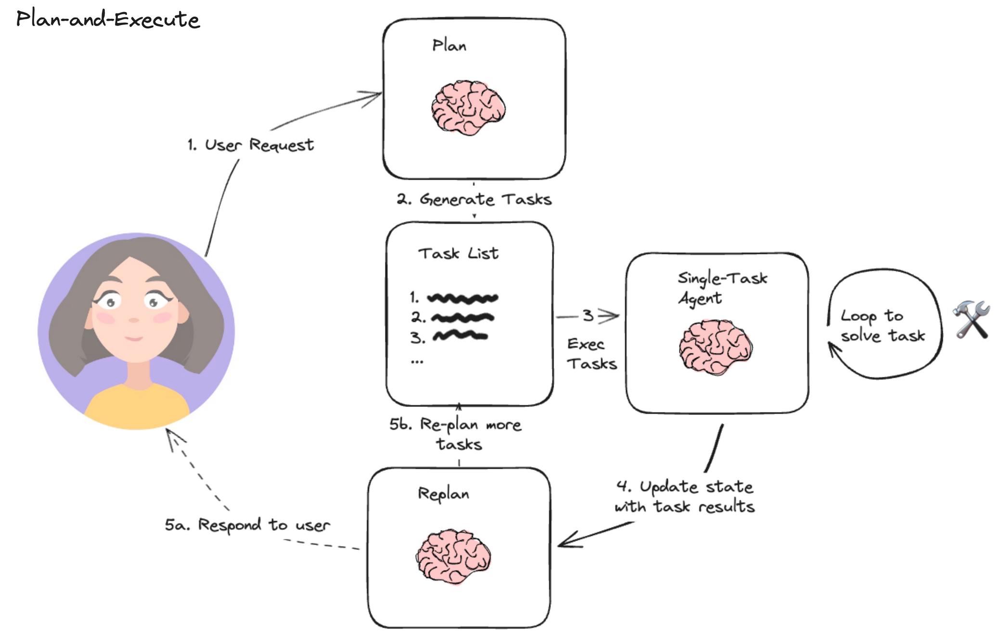

# TP4. Orchestration d'agents avec LangChain

**Durée : 2 h.**

## Objectifs

- Comprendre ce qui distingue un agent d'une simple chaîne : la capacité à choisir
  lui-même ses actions.
- Équiper un agent d'un outil existant (recherche Wikipedia, recherche web) et observer
  son raisonnement.
- Écrire ses propres outils, et les exposer à un agent avec le décorateur `@tool`.
- Connaître les garde-fous d'un agent en production : erreurs de parsing, boucles, coût.

## Prérequis

Le [TP1](tp1-premiers-pas.md) à [TP3](tp3-rag-vecteurs.md) : chaîne, sortie structurée,
recherche par similarité. Bibliothèques supplémentaires : `langchain-community`,
`wikipedia`, `langchain-tavily` (une [clé Tavily](https://www.tavily.com/) gratuite pour
la recherche web).

## Ressources

- [Documentation LangChain, agents](https://python.langchain.com/docs/concepts/agents/).
- [LangChain Hub](https://smith.langchain.com/hub), des prompts d'agents prêts à l'emploi.
- [Le QCM d'auto-évaluation de ce TP](qcm/qcm_tp4.html){ target=_blank }, à faire après la
  séance.

!!! info "Ce TP s'exécute sur votre machine, pas dans le navigateur"
    Comme aux TP précédents, les blocs de code appellent des API distantes et sont donnés
    à titre d'exemple, à recopier dans votre environnement local.

---

## Étape 1. Ce qui distingue un agent d'une chaîne (10 min)

Une chaîne, comme celles des TP précédents, exécute une séquence **fixée à l'avance** par
vous : prompt, puis modèle, puis parseur, toujours dans cet ordre. Un **agent** inverse
cette logique : c'est le modèle lui-même qui décide, à chaque étape, quelle action mener
ensuite parmi un jeu d'outils disponibles, jusqu'à estimer qu'il a de quoi répondre.



Trois briques s'articulent en boucle : le LLM **décide** de la prochaine action, un
**exécuteur** appelle l'outil correspondant, et le résultat revient au LLM pour la
décision suivante. Cette boucle s'arrête quand le modèle juge qu'il peut répondre sans
appeler d'outil de plus.

!!! question "Exercice 1.1 : un cas où un agent apporte quelque chose qu'une chaîne n'apporte pas"
    Décrivez une tâche où le nombre et l'ordre des étapes ne peuvent pas être fixés à
    l'avance, et où un agent capable de décider lui-même serait utile.

    **Résultat attendu :** un exemple où la bonne suite d'actions dépend du résultat d'une
    action précédente, ce qu'une chaîne figée ne peut pas représenter.

    ??? success "Piste de réponse"
        Un assistant qui répond à « quel temps fera-t-il à mon rendez-vous de demain ? »
        doit d'abord retrouver l'adresse du rendez-vous (dans un agenda), puis seulement
        ensuite interroger une API météo avec cette adresse. Une chaîne fixe appellerait
        les deux outils dans un ordre figé, sans pouvoir réagir si le premier échoue ou ne
        renvoie rien ; un agent peut décider d'abandonner, de reformuler sa recherche, ou
        de répondre avec les informations dont il dispose déjà.

## Étape 2. Un agent à un seul outil : interroger Wikipedia (15 min)

Le cas le plus simple : un agent qui ne dispose que d'un seul outil.

```python title="tp4_wikipedia.py"
from langchain_community.tools import WikipediaQueryRun
from langchain_community.utilities import WikipediaAPIWrapper

wikipedia = WikipediaQueryRun(api_wrapper=WikipediaAPIWrapper())
print(wikipedia.run("Alan Turing"))
```

Un outil LangChain, `WikipediaQueryRun` ici, est une fonction que le modèle peut appeler :
elle porte un nom, une description en langage naturel (que le modèle lit pour savoir
**quand** l'utiliser), et une fonction Python qui l'exécute réellement.

!!! question "Exercice 2.1 : un outil borné"
    Écrivez `resume_article(sujet)`, qui appelle l'outil Wikipedia puis tronque le
    résultat à 500 caractères.

    **Résultat attendu :** `resume_article("Alan Turing")` renvoie une chaîne d'au plus
    500 caractères, se terminant proprement (pas au milieu d'un mot).

    ??? success "Corrigé"
        ```python title="exercice 2.1"
        def resume_article(sujet, limite=500):
            texte = wikipedia.run(sujet)
            if len(texte) <= limite:
                return texte
            return texte[:limite].rsplit(" ", 1)[0] + "…"

        print(resume_article("Alan Turing"))
        ```

        Borner la sortie d'un outil n'est pas cosmétique : un outil qui renvoie un texte
        de longueur arbitraire peut faire dépasser la fenêtre de contexte du modèle une
        fois inséré dans le prompt suivant, ou tout simplement gonfler la facture en
        jetons pour rien.

## Étape 3. Un agent qui raisonne : ReAct et la recherche web (25 min)

Le patron **ReAct** (*Reasoning + Acting*) fait alterner le modèle entre une étape de
raisonnement écrit (« il me faut d'abord chercher... ») et une étape d'action (appeler un
outil), ce qui rend sa décision traçable :

```python title="tp4_react.py"
from dotenv import load_dotenv
from langchain import hub
from langchain.agents import create_react_agent, AgentExecutor
from langchain_tavily import TavilySearch
from langchain_mistralai.chat_models import ChatMistralAI

load_dotenv()

recherche = TavilySearch(max_results=2)
outils = [recherche]

llm = ChatMistralAI(model="mistral-large-latest", temperature=0)
prompt = hub.pull("hwchase17/react")
agent = create_react_agent(llm, outils, prompt)
executeur = AgentExecutor(agent=agent, tools=outils, verbose=True)

reponse = executeur.invoke({
    "input": "Dois-je prendre un parapluie, sachant que je me rends aujourd'hui à Belfort ?",
})
print(reponse["output"])
```

`verbose=True` affiche chaque pensée et chaque action de l'agent : c'est la meilleure
façon d'apprendre à en lire un, bien plus que la seule réponse finale.

!!! question "Exercice 3.1 : lire une trace d'agent"
    Exécutez le script avec `verbose=True`, et repérez dans la sortie les trois éléments
    du cycle ReAct : une pensée (*Thought*), une action (*Action*), une observation
    (*Observation*). Combien de fois ce cycle se répète-t-il avant la réponse finale ?

    **Résultat attendu :** au moins un cycle complet pensée/action/observation avant la
    réponse finale (*Final Answer*), parfois plusieurs si la première recherche ne
    suffit pas à répondre.

    ??? success "Corrigé"
        Il n'y a pas de code supplémentaire, l'exercice porte sur la lecture de la trace
        déjà produite. Ce que `verbose=True` révèle est précieux pour déboguer un agent :
        une réponse fausse vient presque toujours d'une **mauvaise requête** envoyée à
        l'outil de recherche, rarement d'un raisonnement final incohérent une fois la bonne
        information en main.

!!! question "Exercice 3.2 : ajouter un second outil"
    Ajoutez `WikipediaQueryRun` (étape 2) à la liste `outils`, et reposez une question qui
    pourrait se répondre par l'un ou l'autre outil (par exemple une question de culture
    générale ET d'actualité). Lequel l'agent choisit-il ?

    **Résultat attendu :** l'agent choisit l'outil dont la **description** correspond le
    mieux à la question, sans que vous ayez à le lui préciser explicitement dans le
    prompt utilisateur.

    ??? success "Corrigé"
        ```python title="exercice 3.2"
        from langchain_community.tools import WikipediaQueryRun
        from langchain_community.utilities import WikipediaAPIWrapper

        wikipedia = WikipediaQueryRun(api_wrapper=WikipediaAPIWrapper())
        outils = [recherche, wikipedia]
        agent = create_react_agent(llm, outils, prompt)
        executeur = AgentExecutor(agent=agent, tools=outils, verbose=True)

        reponse = executeur.invoke({"input": "Qui a inventé le test qui porte le nom d'Alan Turing ?"})
        print(reponse["output"])
        ```

        C'est la description de chaque outil, pas son nom, qui guide la décision du
        modèle. Une description vague ou trompeuse (« cherche des trucs ») produit un
        agent qui choisit mal ses outils, même s'ils fonctionnent parfaitement une fois
        appelés.

## Étape 4. Écrire ses propres outils (25 min)

N'importe quelle fonction Python devient un outil avec le décorateur `@tool`, à condition
d'avoir une signature typée et une docstring, la description que le modèle lira :

```python title="tp4_outils.py"
from langchain_core.tools import tool

@tool
def multiplie(a: int, b: int) -> int:
    """Multiplie deux entiers."""
    return a * b

@tool
def additionne(a: int, b: int) -> int:
    """Additionne deux entiers."""
    return a + b

@tool
def puissance(base: int, exposant: int) -> int:
    """Calcule base élevé à la puissance exposant."""
    return base ** exposant
```

```python title="tp4_agent_calcul.py"
from dotenv import load_dotenv
from langchain import hub
from langchain.agents import AgentExecutor, create_tool_calling_agent
from langchain_mistralai.chat_models import ChatMistralAI

load_dotenv()

outils = [multiplie, additionne, puissance]
llm = ChatMistralAI(model="mistral-large-latest", temperature=0)
prompt = hub.pull("hwchase17/openai-tools-agent")
agent = create_tool_calling_agent(llm, outils, prompt)
executeur = AgentExecutor(agent=agent, tools=outils, verbose=True)

executeur.invoke({
    "input": "Calcule 3 à la puissance 5, multiplie le résultat par la somme de 12 et 3, "
             "puis élève le tout au carré.",
})
```

!!! warning "L'IA vous le donne en trois secondes"
    Demandez à un assistant d'écrire un outil `divise(a: int, b: int) -> float` du même
    genre. Il oubliera presque toujours de gérer `b = 0`. Un outil exposé à un agent n'est
    plus seulement une fonction que vous appelez en connaissant vos données : c'est le
    modèle qui décide des arguments, et rien ne l'empêche de tenter une division par
    zéro s'il pense que c'est la bonne action. Ajoutez le contrôle qui manque, puis
    testez avec un prompt qui pousse délibérément l'agent vers ce cas.

!!! question "Exercice 4.1 : un outil qui valide ses entrées"
    Écrivez un outil `racine_carree(x: float) -> float` qui lève une erreur explicite,
    interceptée proprement, si `x` est négatif, plutôt que de laisser `math.sqrt` échouer
    avec un `ValueError` peu clair pour l'agent.

    **Résultat attendu :** `racine_carree(16)` renvoie `4.0` ; `racine_carree(-4)` renvoie
    un message d'erreur clair que l'agent peut relire et éventuellement corriger, plutôt
    qu'un plantage.

    ??? success "Corrigé"
        ```python title="exercice 4.1"
        import math
        from langchain_core.tools import tool

        @tool
        def racine_carree(x: float) -> str:
            """Calcule la racine carrée d'un nombre positif ou nul."""
            if x < 0:
                return f"Erreur : {x} est négatif, pas de racine carrée réelle."
            return str(math.sqrt(x))
        ```

        Faire renvoyer un **message** plutôt que de laisser une exception remonter est un
        choix délibéré : un agent peut lire un message d'erreur et changer de stratégie
        (reposer la question, essayer une autre valeur), alors qu'une exception non
        interceptée arrête tout l'exécuteur.

## Étape 5. Les garde-fous d'un agent (20 min)

Un agent qui appelle des outils réels peut échouer de façons qu'une simple chaîne ne
rencontre jamais : un outil renvoie un format que le modèle interprète mal, une boucle de
décision ne converge pas, ou le coût s'envole si chaque tour de boucle appelle l'API.

```python title="tp4_garde_fous.py"
executeur = AgentExecutor(
    agent=agent,
    tools=outils,
    verbose=True,
    handle_parsing_errors=True,
    max_iterations=5,
)
```

`handle_parsing_errors=True` renvoie l'erreur au modèle pour qu'il corrige sa syntaxe au
lieu de faire planter tout le programme. `max_iterations` borne le nombre de cycles
pensée/action, contre un agent qui tournerait indéfiniment sans jamais conclure.

!!! question "Exercice 5.1 : observer une erreur de parsing"
    Désactivez volontairement `handle_parsing_errors` (`handle_parsing_errors=False`, le
    défaut) et relancez l'agent de l'étape 4 plusieurs fois. Arrivez-vous à provoquer une
    erreur ? Que se passe-t-il alors pour le programme entier ?

    **Résultat attendu :** sans `handle_parsing_errors`, une réponse du modèle mal
    formée (qui ne respecte pas le format attendu par l'exécuteur) lève une exception qui
    remonte jusqu'à interrompre le script, plutôt que d'être corrigée en cours de route.

    ??? success "Corrigé"
        Il n'y a pas de code figé à écrire, une erreur de parsing dépend de la réponse
        réelle du modèle et n'est pas garantie à chaque essai. Le point à retenir : dans
        un agent qui tourne sans supervision humaine (un service, un traitement par lot),
        `handle_parsing_errors=True` et une borne `max_iterations` ne sont pas des options
        de confort, ce sont les deux lignes qui évitent qu'une réponse mal formée ou un
        raisonnement qui boucle ne fasse tomber tout le service.

## Pour aller plus loin

- L'outil `arxiv` (via `langchain.agents.load_tools(["arxiv"])`) permet à un agent
  d'interroger directement la littérature scientifique.
- `PythonREPLTool` donne à un agent la capacité d'exécuter du code Python pour répondre à
  une question calculatoire, une alternative à l'écriture d'un outil dédié pour chaque
  calcul.
- Au delà d'un seul agent, plusieurs agents spécialisés (un « chercheur », un
  « analyste ») peuvent être orchestrés par un contrôleur commun : c'est le principe des
  frameworks multi-agents comme LangGraph.

## Ce qu'il faut retenir

Une chaîne exécute une séquence fixée à l'avance ; un agent décide lui-même, à chaque
tour, quelle action mener parmi un jeu d'outils, dans une boucle décision-exécution-retour.
Un outil LangChain est une fonction Python typée et documentée : sa description guide le
choix du modèle, tout comme le message système guidait la chaîne des TP précédents. Un
agent qui touche à de vrais outils a besoin de garde-fous qu'une chaîne n'exige pas :
gestion des erreurs de format (`handle_parsing_errors`) et borne sur le nombre d'itérations
(`max_iterations`), sans quoi une réponse mal formée ou un raisonnement qui boucle peut
faire tomber tout le programme.

## Auto-évaluation

Avant de passer au TP5, vous devez pouvoir, sans regarder le corrigé :

- [ ] expliquer la différence entre une chaîne et un agent ;
- [ ] décrire le cycle pensée/action/observation du patron ReAct ;
- [ ] écrire un outil avec `@tool`, une signature typée et une docstring ;
- [ ] dire pourquoi la description d'un outil compte autant que son implémentation ;
- [ ] citer les deux garde-fous qui protègent un agent en production, et ce que chacun
      empêche.

[Le QCM du TP4](qcm/qcm_tp4.html){ .md-button target=_blank }
[Passer au TP5](tp5-multimodalite.md){ .md-button .md-button--primary }
